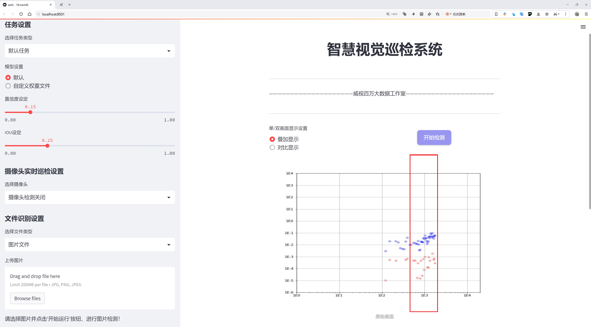
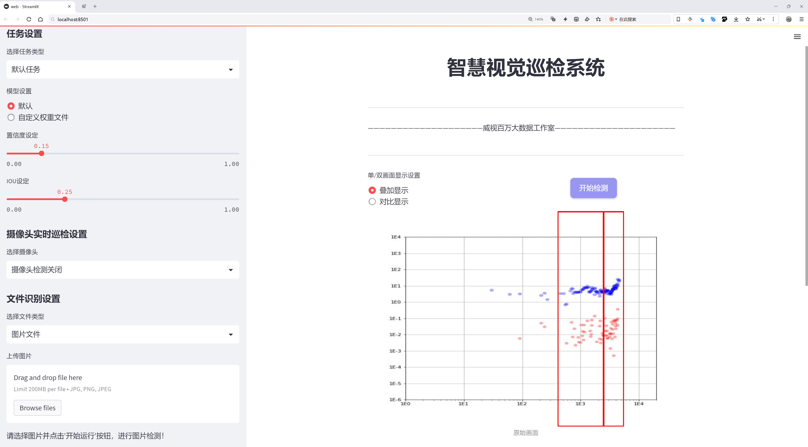
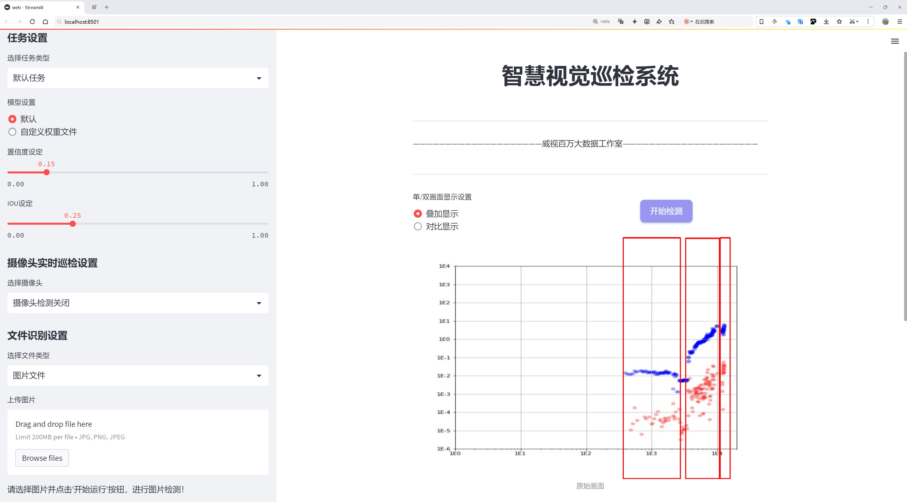
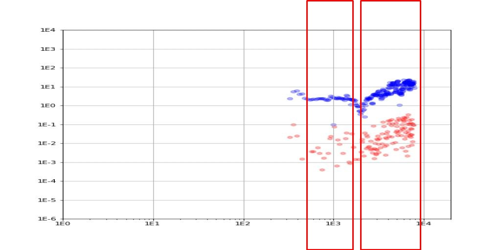
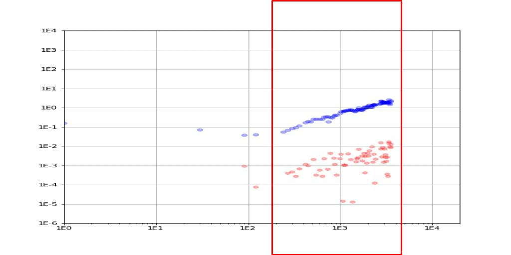
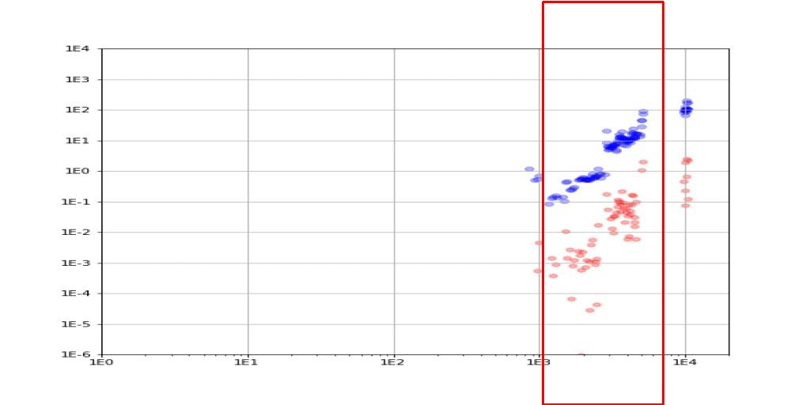
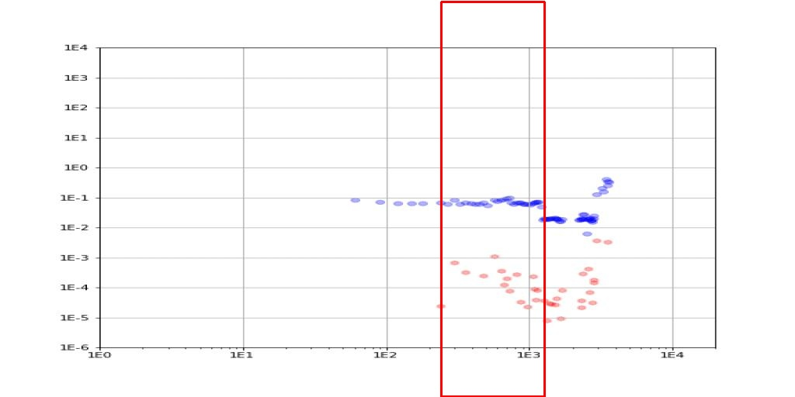
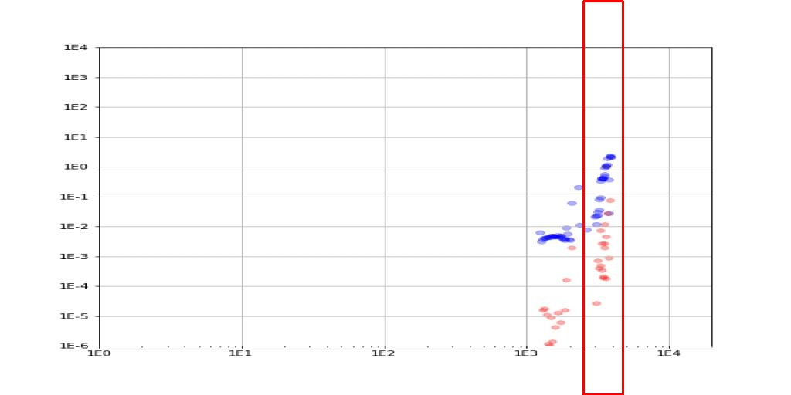

# 散点图数据点集中区域定位检测系统源码分享
 # [一条龙教学YOLOV8标注好的数据集一键训练_70+全套改进创新点发刊_Web前端展示]

### 1.研究背景与意义

项目参考[AAAI Association for the Advancement of Artificial Intelligence](https://gitee.com/qunshansj/projects)

项目来源[AACV Association for the Advancement of Computer Vision](https://gitee.com/qunmasj/projects)

研究背景与意义

随着计算机视觉技术的迅猛发展，目标检测领域的研究逐渐成为学术界和工业界的热点。YOLO（You Only Look Once）系列模型因其实时性和高效性，广泛应用于各类视觉任务中。尤其是YOLOv8的提出，进一步提升了目标检测的精度和速度，使其在复杂场景下的应用成为可能。然而，尽管YOLOv8在传统目标检测任务中表现优异，但在处理特定领域的数据集时，仍然面临着诸多挑战，尤其是在散点图数据点集中区域的定位问题上。

本研究围绕“基于改进YOLOv8的散点图数据点集中区域定位系统”展开，旨在针对特定的散点图数据集进行深入分析与改进。该数据集包含3200幅图像，涵盖了7个类别，包括底水锥化、锥化后通道化、恒定作业、多层通道化、正常位移、快速通道化和盗取区等。这些类别的多样性使得目标检测任务的复杂性显著增加，尤其是在不同类别之间存在相似特征时，模型的区分能力面临挑战。因此，如何有效地提取特征并提高模型在这些特定类别上的检测精度，成为了本研究的核心问题。

在此背景下，改进YOLOv8模型的必要性愈发凸显。传统YOLOv8模型在处理散点图数据时，可能无法充分利用图像中的上下文信息，导致目标检测的准确性不足。为此，本研究将探索多种改进策略，包括但不限于引入注意力机制、优化特征提取网络、增强数据预处理等，以提升模型在特定任务中的表现。通过这些改进，期望能够提高模型对散点图中数据点集中区域的定位能力，从而为后续的分析和决策提供更为准确的信息支持。

此外，本研究的意义不仅体现在理论层面，更在于其实际应用价值。散点图数据在地质勘探、环境监测、资源管理等领域具有广泛的应用前景。通过构建高效的散点图数据点集中区域定位系统，可以为相关领域的研究者和工程师提供强有力的工具，帮助他们更好地理解和分析复杂的数据模式。这将有助于推动相关领域的技术进步，提高资源利用效率，促进可持续发展。

综上所述，基于改进YOLOv8的散点图数据点集中区域定位系统的研究，不仅具有重要的学术价值，也为实际应用提供了切实可行的解决方案。通过深入探索和优化目标检测技术，期望能够为散点图数据的分析与应用开辟新的路径，推动相关领域的研究进展。

### 2.图片演示







##### 注意：由于此博客编辑较早，上面“2.图片演示”和“3.视频演示”展示的系统图片或者视频可能为老版本，新版本在老版本的基础上升级如下：（实际效果以升级的新版本为准）

  （1）适配了YOLOV8的“目标检测”模型和“实例分割”模型，通过加载相应的权重（.pt）文件即可自适应加载模型。

  （2）支持“图片识别”、“视频识别”、“摄像头实时识别”三种识别模式。

  （3）支持“图片识别”、“视频识别”、“摄像头实时识别”三种识别结果保存导出，解决手动导出（容易卡顿出现爆内存）存在的问题，识别完自动保存结果并导出到tempDir中。

  （4）支持Web前端系统中的标题、背景图等自定义修改，后面提供修改教程。

  另外本项目提供训练的数据集和训练教程,暂不提供权重文件（best.pt）,需要您按照教程进行训练后实现图片演示和Web前端界面演示的效果。

### 3.视频演示

[3.1 视频演示](https://www.bilibili.com/video/BV1AntaeoEys/)

### 4.数据集信息展示

##### 4.1 本项目数据集详细数据（类别数＆类别名）

nc: 5
names: ['coning', 'constant', 'multilayer', 'normal', 'rapid']


##### 4.2 本项目数据集信息介绍

数据集信息展示

在本研究中，我们采用了名为“full_pics_MAD_2”的数据集，以支持对YOLOv8模型的改进，特别是在散点图数据点集中区域定位系统的训练过程中。该数据集的设计旨在提供多样化且具有代表性的样本，以便更好地捕捉和识别不同类别的特征，从而提升模型的准确性和鲁棒性。

“full_pics_MAD_2”数据集包含五个主要类别，分别为“coning”、“constant”、“multilayer”、“normal”和“rapid”。这些类别的选择不仅考虑了实际应用中的多样性，还涵盖了散点图中可能出现的各种模式和趋势。每个类别都代表了一种特定的散点图形态，具有独特的视觉特征和数据分布，这为模型的训练提供了丰富的样本基础。

在数据集的构建过程中，研究团队特别注重样本的多样性和代表性。每个类别都包含了大量的图像，这些图像在拍摄条件、视角、光照和背景等方面均有所不同。这种多样性确保了模型在面对不同环境和条件时，能够保持良好的识别能力。例如，“coning”类别的图像可能展示了在不同角度下的锥形分布，而“normal”类别则可能包含了常规的散点分布模式。这种细致的分类和样本选择，有助于模型学习到更为复杂的特征，从而提高其在实际应用中的表现。

此外，数据集中的每个图像都经过精确标注，确保每个散点的位置信息和类别标签的准确性。这种高质量的标注是训练深度学习模型的关键，因为它直接影响到模型的学习效果和最终的预测性能。通过使用“full_pics_MAD_2”数据集，我们能够为YOLOv8模型提供一个坚实的基础，使其在处理散点图数据时，能够有效地识别和定位不同类别的区域。

在数据集的使用过程中，我们还计划进行多轮的实验和验证，以评估模型在不同训练阶段的表现。通过对比模型在使用“full_pics_MAD_2”数据集前后的效果，我们希望能够量化改进的程度，并进一步优化模型的参数设置和训练策略。这一过程不仅有助于提升模型的性能，也为后续的研究提供了宝贵的经验和数据支持。

综上所述，“full_pics_MAD_2”数据集为改进YOLOv8的散点图数据点集中区域定位系统提供了丰富的样本和可靠的标注信息。通过对该数据集的深入分析和应用，我们期望能够在散点图数据处理领域取得显著的进展，推动相关技术的发展和应用。











### 5.全套项目环境部署视频教程（零基础手把手教学）

[5.1 环境部署教程链接（零基础手把手教学）](https://www.ixigua.com/7404473917358506534?logTag=c807d0cbc21c0ef59de5)


[5.2 安装Python虚拟环境创建和依赖库安装视频教程链接（零基础手把手教学）](https://www.ixigua.com/7404474678003106304?logTag=1f1041108cd1f708b01a)

### 6.手把手YOLOV8训练视频教程（零基础小白有手就能学会）

[6.1 手把手YOLOV8训练视频教程（零基础小白有手就能学会）](https://www.ixigua.com/7404477157818401292?logTag=d31a2dfd1983c9668658)

### 7.70+种全套YOLOV8创新点代码加载调参视频教程（一键加载写好的改进模型的配置文件）

[7.1 70+种全套YOLOV8创新点代码加载调参视频教程（一键加载写好的改进模型的配置文件）](https://www.ixigua.com/7404478314661806627?logTag=29066f8288e3f4eea3a4)

### 8.70+种全套YOLOV8创新点原理讲解（非科班也可以轻松写刊发刊，V10版本正在科研待更新）

由于篇幅限制，每个创新点的具体原理讲解就不一一展开，具体见下列网址中的创新点对应子项目的技术原理博客网址【Blog】：


[8.1 70+种全套YOLOV8创新点原理讲解链接](https://gitee.com/qunmasj/good)

### 9.系统功能展示（检测对象为举例，实际内容以本项目数据集为准）

图9.1.系统支持检测结果表格显示

  图9.2.系统支持置信度和IOU阈值手动调节

  图9.3.系统支持自定义加载权重文件best.pt(需要你通过步骤5中训练获得)

  图9.4.系统支持摄像头实时识别

  图9.5.系统支持图片识别

  图9.6.系统支持视频识别

  图9.7.系统支持识别结果文件自动保存

  图9.8.系统支持Excel导出检测结果数据


### 10.原始YOLOV8算法原理

原始YOLOv8算法原理

YOLOv8作为目标检测领域的最新代表，继承并发展了YOLO系列的优良传统，特别是在检测精度和速度方面的显著提升，使其在众多应用场景中脱颖而出。该算法的核心思想是通过实时处理图像，快速准确地识别和定位目标物体。YOLOv8的架构主要由输入层、骨干网络、颈部网络和头部网络四个部分构成，各个部分相辅相成，共同实现高效的目标检测。

在输入层，YOLOv8首先对输入图像进行预处理，包括马赛克数据增强、自适应锚框计算和自适应灰度填充等操作。这些步骤不仅增强了数据的多样性，还提高了模型对不同场景的适应能力。通过这些预处理，YOLOv8能够在多种环境下保持良好的检测性能。

骨干网络是YOLOv8的特征提取核心，其结构经过精心设计，以提高特征提取的效率和准确性。与YOLOv5相比，YOLOv8采用了更为轻量化的C2F模块，取代了原有的C3模块。C2F模块的设计灵感来源于YOLOv7中的E-ELAN结构，通过跨层分支连接，增强了模型的梯度流动性，从而改善了特征的表示能力。此外，骨干网络中还引入了空间金字塔池化（SPPF）模块，利用多个最大池化层处理多尺度特征，进一步提升了网络的特征抽象能力。

颈部网络则是YOLOv8的重要组成部分，负责融合来自不同尺度的特征图信息。该部分结合了特征金字塔网络（FPN）和路径聚合网络（PAN）的优点，通过高效的特征融合策略，增强了模型对不同尺度目标的检测能力。为了进一步提升模型的轻量化和特征提取速度，YOLOv8在颈部网络中引入了BiFPN网络。BiFPN的设计理念是通过双向跨尺度连接和加权特征融合，优化特征信息的流动，使得模型在处理复杂场景时能够更快速地提取关键信息。

在头部网络中，YOLOv8采用了解耦的检测头结构，这一创新显著提升了目标检测的效率。与传统的耦合头相比，解耦头将分类和回归过程分开进行，分别通过两个并行的卷积分支进行计算。这种设计不仅简化了模型的计算流程，还减少了锚框的预测数量，进而加速了非最大抑制（NMS）过程，提高了检测速度和精度。具体而言，分类分支使用二元交叉熵损失（BCELoss）进行训练，而回归分支则结合了分布焦点损失（DFLoss）和完全交并比损失函数（CIOULoss），从而在边界框预测上实现更高的准确性。

YOLOv8的整体架构在设计上充分考虑了轻量化和高效性，使得该模型在保证检测精度的同时，能够在资源受限的环境中运行。通过对不同规模的模型进行参数调整，YOLOv8提供了n、s、m、l、x五种不同版本，以满足不同应用场景的需求。其中，YOLOv8n版本以最小的参数量和最快的检测速度，成为实时目标检测的理想选择。

总的来说，YOLOv8在算法原理上实现了多方面的创新与优化，尤其是在特征提取、特征融合和检测头设计等关键环节。通过引入更为高效的模块和结构，YOLOv8不仅提升了目标检测的精度和速度，还在轻量化设计上取得了显著进展。这些改进使得YOLOv8在实际应用中具备了更强的适应性和灵活性，能够广泛应用于自动驾驶、安防监控、智能交通等多个领域，推动了目标检测技术的进一步发展。


### 11.项目核心源码讲解（再也不用担心看不懂代码逻辑）

#### 11.1 ui.py

以下是对代码的核心部分进行提炼和详细注释的版本：

```python
import sys
import subprocess

def run_script(script_path):
    """
    使用当前 Python 环境运行指定的脚本。

    Args:
        script_path (str): 要运行的脚本路径

    Returns:
        None
    """
    # 获取当前 Python 解释器的路径
    python_path = sys.executable

    # 构建运行命令，使用 streamlit 运行指定的脚本
    command = f'"{python_path}" -m streamlit run "{script_path}"'

    # 执行命令
    result = subprocess.run(command, shell=True)
    
    # 检查命令执行结果，如果返回码不为0，则表示出错
    if result.returncode != 0:
        print("脚本运行出错。")

# 程序入口
if __name__ == "__main__":
    # 指定要运行的脚本路径
    script_path = "web.py"  # 这里可以替换为实际的脚本路径

    # 调用函数运行脚本
    run_script(script_path)
```

### 代码注释说明：

1. **导入模块**：
   - `sys`：用于访问与 Python 解释器紧密相关的变量和函数。
   - `subprocess`：用于执行外部命令和程序。

2. **定义 `run_script` 函数**：
   - 该函数接受一个参数 `script_path`，表示要运行的 Python 脚本的路径。
   - 使用 `sys.executable` 获取当前 Python 解释器的路径，以确保在正确的环境中运行脚本。
   - 构建一个命令字符串，使用 `streamlit` 运行指定的脚本。
   - 使用 `subprocess.run` 执行构建的命令，并通过 `shell=True` 允许在 shell 中执行命令。
   - 检查命令的返回码，如果不为0，表示脚本运行出错，打印错误信息。

3. **程序入口**：
   - 使用 `if __name__ == "__main__":` 确保该代码块仅在直接运行该脚本时执行。
   - 指定要运行的脚本路径（在此示例中为 `web.py`）。
   - 调用 `run_script` 函数来执行指定的脚本。 

这样，代码的核心逻辑和功能得以保留，同时也提供了详细的中文注释以便理解。

这个文件名为 `ui.py`，它的主要功能是运行一个指定的 Python 脚本，具体来说是通过 Streamlit 框架来启动一个 Web 应用。代码的结构比较简单，主要由几个部分组成。

首先，文件引入了一些必要的模块，包括 `sys`、`os` 和 `subprocess`。其中，`sys` 模块用于访问与 Python 解释器紧密相关的变量和函数，`os` 模块提供了与操作系统交互的功能，而 `subprocess` 模块则用于执行外部命令。

接下来，代码定义了一个名为 `run_script` 的函数，该函数接受一个参数 `script_path`，表示要运行的脚本的路径。在函数内部，首先获取当前 Python 解释器的路径，这通过 `sys.executable` 实现。然后，构建一个命令字符串，使用 Streamlit 来运行指定的脚本。具体的命令格式是 `"{python_path}" -m streamlit run "{script_path}"`，其中 `python_path` 是当前 Python 解释器的路径，`script_path` 是要运行的脚本路径。

随后，使用 `subprocess.run` 方法来执行构建好的命令。这个方法会在一个新的进程中运行命令，并等待其完成。如果命令执行的返回码不为 0，表示运行过程中出现了错误，此时会打印出“脚本运行出错。”的提示信息。

最后，在文件的主程序部分，通过 `if __name__ == "__main__":` 语句来确保只有在直接运行该脚本时才会执行以下代码。在这里，首先调用 `abs_path` 函数来获取 `web.py` 脚本的绝对路径，并将其赋值给 `script_path` 变量。然后，调用 `run_script` 函数，传入 `script_path`，以启动指定的 Web 应用。

总体来说，这个 `ui.py` 文件的作用是为一个 Streamlit 应用提供一个启动脚本，通过简单的命令行调用来运行 Web 应用，方便用户在当前 Python 环境中启动和调试应用。

#### 11.2 code\ultralytics\models\sam\model.py

以下是经过简化和注释的核心代码部分：

```python
from pathlib import Path
from ultralytics.engine.model import Model
from .build import build_sam
from .predict import Predictor

class SAM(Model):
    """
    SAM (Segment Anything Model) 接口类，用于实时图像分割。
    支持多种提示方式，如边界框、点或标签，并具备零-shot 性能。
    """

    def __init__(self, model="sam_b.pt") -> None:
        """
        初始化 SAM 模型，加载预训练模型文件。

        参数:
            model (str): 预训练模型文件的路径，文件扩展名应为 .pt 或 .pth。

        异常:
            NotImplementedError: 如果模型文件扩展名不是 .pt 或 .pth。
        """
        # 检查模型文件扩展名
        if model and Path(model).suffix not in (".pt", ".pth"):
            raise NotImplementedError("SAM 预测需要预训练的 *.pt 或 *.pth 模型。")
        super().__init__(model=model, task="segment")

    def _load(self, weights: str, task=None):
        """
        加载指定的权重到 SAM 模型中。

        参数:
            weights (str): 权重文件的路径。
            task (str, optional): 任务名称，默认为 None。
        """
        self.model = build_sam(weights)

    def predict(self, source, stream=False, bboxes=None, points=None, labels=None, **kwargs):
        """
        对给定的图像或视频源进行分割预测。

        参数:
            source (str): 图像或视频文件的路径，或 PIL.Image 对象，或 numpy.ndarray 对象。
            stream (bool, optional): 如果为 True，则启用实时流。默认为 False。
            bboxes (list, optional): 提示分割的边界框坐标列表。默认为 None。
            points (list, optional): 提示分割的点列表。默认为 None。
            labels (list, optional): 提示分割的标签列表。默认为 None。

        返回:
            (list): 模型的预测结果。
        """
        # 设置预测的默认参数
        overrides = dict(conf=0.25, task="segment", mode="predict", imgsz=1024)
        kwargs.update(overrides)  # 更新参数
        prompts = dict(bboxes=bboxes, points=points, labels=labels)  # 收集提示信息
        return super().predict(source, stream, prompts=prompts, **kwargs)

    def __call__(self, source=None, stream=False, bboxes=None, points=None, labels=None, **kwargs):
        """
        'predict' 方法的别名。

        参数与 predict 方法相同。

        返回:
            (list): 模型的预测结果。
        """
        return self.predict(source, stream, bboxes, points, labels, **kwargs)

    def info(self, detailed=False, verbose=True):
        """
        记录有关 SAM 模型的信息。

        参数:
            detailed (bool, optional): 如果为 True，显示模型的详细信息。默认为 False。
            verbose (bool, optional): 如果为 True，在控制台显示信息。默认为 True。

        返回:
            (tuple): 包含模型信息的元组。
        """
        return model_info(self.model, detailed=detailed, verbose=verbose)

    @property
    def task_map(self):
        """
        提供 'segment' 任务与其对应的 'Predictor' 的映射。

        返回:
            (dict): 将 'segment' 任务映射到其对应的 'Predictor' 的字典。
        """
        return {"segment": {"predictor": Predictor}}
```

### 代码注释说明：
1. **类的定义**：`SAM` 类继承自 `Model`，用于实现图像分割功能。
2. **初始化方法**：`__init__` 方法用于加载预训练模型，并检查文件扩展名是否合法。
3. **加载权重**：`_load` 方法用于加载指定的模型权重。
4. **预测方法**：`predict` 方法实现了对图像或视频源的分割预测，支持实时流和多种提示方式。
5. **调用方法**：`__call__` 方法使得 `SAM` 类的实例可以像函数一样被调用，实际上调用的是 `predict` 方法。
6. **信息记录**：`info` 方法用于记录和返回模型的信息。
7. **任务映射**：`task_map` 属性提供了任务与预测器之间的映射关系。

这个程序文件是Ultralytics YOLO项目中的一个模块，主要用于实现Segment Anything Model（SAM）的接口。SAM模型专门设计用于实时图像分割任务，具有很高的灵活性，能够根据不同的提示进行分割，并且具备零-shot性能，意味着它可以在没有先前知识的情况下适应新的图像分布和任务。该模型是在SA-1B数据集上训练的。

文件中首先导入了一些必要的库和模块，包括路径处理、模型基类、模型信息获取工具、SAM模型的构建函数以及预测器类。接着定义了一个名为SAM的类，继承自Model类，作为SAM模型的接口类。

在类的初始化方法中，SAM模型接受一个预训练模型文件的路径，文件扩展名必须是.pt或.pth。如果扩展名不符合要求，则会抛出NotImplementedError异常。初始化完成后，调用父类的构造函数，指定任务为“segment”。

_load方法用于加载指定的权重文件，将其应用于SAM模型。predict方法则是执行分割预测的核心功能，支持对图像或视频源进行处理，并可以通过bounding boxes、points或labels等提示进行分割。该方法还支持实时流式处理。

__call__方法是predict方法的别名，提供了相同的功能，使得用户可以通过调用类的实例来直接进行预测。

info方法用于记录和显示SAM模型的信息，用户可以选择是否显示详细信息和控制台输出。

最后，task_map属性提供了一个字典，将“segment”任务映射到相应的预测器，这样可以方便地管理不同任务的预测功能。

整体来看，这个模块为用户提供了一个高效、灵活的接口，用于实现实时图像分割，适用于各种应用场景。

#### 11.3 code\ultralytics\solutions\heatmap.py

以下是经过简化并添加详细中文注释的核心代码部分：

```python
import cv2
import numpy as np
from collections import defaultdict
from shapely.geometry import LineString, Point, Polygon

class Heatmap:
    """用于实时视频流中绘制热图的类，基于物体的轨迹。"""

    def __init__(self):
        """初始化热图类，设置默认的可视化和热图参数。"""
        # 可视化信息
        self.annotator = None  # 注释器
        self.view_img = False  # 是否显示图像
        self.shape = "circle"  # 热图形状

        # 图像信息
        self.imw = None  # 图像宽度
        self.imh = None  # 图像高度
        self.im0 = None  # 原始图像
        self.view_in_counts = True  # 是否显示入计数
        self.view_out_counts = True  # 是否显示出计数

        # 热图相关参数
        self.colormap = None  # 热图颜色映射
        self.heatmap = None  # 热图数组
        self.heatmap_alpha = 0.5  # 热图透明度

        # 预测/跟踪信息
        self.boxes = None  # 物体框
        self.track_ids = None  # 跟踪ID
        self.clss = None  # 类别
        self.track_history = defaultdict(list)  # 跟踪历史

        # 区域和线的信息
        self.count_reg_pts = None  # 计数区域点
        self.counting_region = None  # 计数区域
        self.line_dist_thresh = 15  # 线计数的距离阈值
        self.region_thickness = 5  # 区域厚度
        self.region_color = (255, 0, 255)  # 区域颜色

        # 物体计数信息
        self.in_counts = 0  # 入计数
        self.out_counts = 0  # 出计数
        self.counting_list = []  # 计数列表

        # 衰减因子
        self.decay_factor = 0.99  # 衰减因子

    def set_args(self, imw, imh, colormap=cv2.COLORMAP_JET, heatmap_alpha=0.5, view_img=False,
                 view_in_counts=True, view_out_counts=True, count_reg_pts=None,
                 region_thickness=5, line_dist_thresh=15, decay_factor=0.99, shape="circle"):
        """
        配置热图的颜色映射、宽度、高度和显示参数。
        """
        self.imw = imw  # 设置图像宽度
        self.imh = imh  # 设置图像高度
        self.heatmap_alpha = heatmap_alpha  # 设置热图透明度
        self.view_img = view_img  # 设置是否显示图像
        self.view_in_counts = view_in_counts  # 设置是否显示入计数
        self.view_out_counts = view_out_counts  # 设置是否显示出计数
        self.colormap = colormap  # 设置热图颜色映射

        # 选择计数区域和线
        if count_reg_pts is not None:
            if len(count_reg_pts) == 2:  # 线计数
                self.count_reg_pts = count_reg_pts
                self.counting_region = LineString(count_reg_pts)
            elif len(count_reg_pts) == 4:  # 区域计数
                self.count_reg_pts = count_reg_pts
                self.counting_region = Polygon(self.count_reg_pts)
            else:
                print("无效的区域或线点，支持2或4个点")
                self.counting_region = Polygon([(20, 400), (1260, 400)])  # 默认线

        # 初始化热图
        self.heatmap = np.zeros((int(self.imh), int(self.imw)), dtype=np.float32)

        # 设置其他参数
        self.region_thickness = region_thickness
        self.decay_factor = decay_factor
        self.line_dist_thresh = line_dist_thresh
        self.shape = shape

    def extract_results(self, tracks):
        """
        从提供的数据中提取结果。
        """
        self.boxes = tracks[0].boxes.xyxy.cpu()  # 获取物体框
        self.clss = tracks[0].boxes.cls.cpu().tolist()  # 获取类别
        self.track_ids = tracks[0].boxes.id.int().cpu().tolist()  # 获取跟踪ID

    def generate_heatmap(self, im0, tracks):
        """
        根据跟踪数据生成热图。
        """
        self.im0 = im0  # 设置当前图像
        if tracks[0].boxes.id is None:  # 如果没有跟踪ID
            return
        self.heatmap *= self.decay_factor  # 应用衰减因子
        self.extract_results(tracks)  # 提取跟踪结果

        # 绘制计数区域
        if self.count_reg_pts is not None:
            for box, track_id in zip(self.boxes, self.track_ids):
                # 更新热图
                self.heatmap[int(box[1]):int(box[3]), int(box[0]):int(box[2])] += 2

                # 计数逻辑
                if self.counting_region.contains(Point((box[0] + box[2]) / 2, (box[1] + box[3]) / 2)):
                    if track_id not in self.counting_list:
                        self.counting_list.append(track_id)
                        if box[0] < self.counting_region.centroid.x:
                            self.out_counts += 1
                        else:
                            self.in_counts += 1

        # 归一化热图并应用颜色映射
        heatmap_normalized = cv2.normalize(self.heatmap, None, 0, 255, cv2.NORM_MINMAX)
        heatmap_colored = cv2.applyColorMap(heatmap_normalized.astype(np.uint8), self.colormap)

        # 将热图与原始图像结合
        self.im0 = cv2.addWeighted(self.im0, 1 - self.heatmap_alpha, heatmap_colored, self.heatmap_alpha, 0)

        return self.im0  # 返回合成后的图像

    def display_frames(self):
        """显示当前帧。"""
        cv2.imshow("Ultralytics Heatmap", self.im0)
        if cv2.waitKey(1) & 0xFF == ord("q"):
            return

if __name__ == "__main__":
    Heatmap()  # 创建热图实例
```

### 代码说明：
1. **Heatmap类**：用于处理视频流中的热图生成，主要功能包括初始化参数、设置计数区域、提取跟踪结果、生成热图和显示帧。
2. **set_args方法**：用于配置热图的各种参数，包括图像尺寸、颜色映射、透明度等。
3. **extract_results方法**：从跟踪数据中提取物体框、类别和跟踪ID。
4. **generate_heatmap方法**：根据跟踪数据生成热图，并更新计数信息。
5. **display_frames方法**：用于显示当前处理的帧。

此代码的核心在于实时生成热图并进行物体计数，适用于监控和分析场景。

这个程序文件定义了一个名为 `Heatmap` 的类，用于在实时视频流中基于物体轨迹绘制热图。程序首先导入了一些必要的库，包括 `cv2` 和 `numpy`，以及一些来自 `ultralytics` 的工具函数和 `shapely` 库中的几何形状类。

在 `Heatmap` 类的初始化方法中，设置了一些默认的可视化、图像和热图参数，包括图像的宽度和高度、热图的颜色映射、透明度、计数区域的定义等。该类还维护了一个用于跟踪的历史记录和计数信息。

`set_args` 方法用于配置热图的各种参数，包括图像的宽高、颜色映射、是否显示图像、计数区域的点等。根据传入的计数区域点的数量，程序会初始化一个线性计数器或区域计数器，并创建一个空的热图数组。

`extract_results` 方法从跟踪数据中提取物体的边界框、类别和跟踪ID。这些信息将用于生成热图。

`generate_heatmap` 方法是核心功能，接收当前帧图像和跟踪数据。它首先检查跟踪ID是否存在，然后根据设定的衰减因子更新热图。接着，程序提取跟踪结果，并使用 `Annotator` 类在图像上绘制计数区域和物体的热图。

在绘制热图时，程序根据指定的形状（圆形或矩形）在热图上添加相应的值，并记录物体的轨迹。根据计数区域的定义，程序还会统计物体的进出计数。

最后，程序对热图进行归一化处理，并将其与原始图像合成，显示进出计数信息。若用户选择显示图像，程序会调用 `display_frames` 方法来展示结果。

整个类的设计使得它能够在视频流中实时更新热图，提供物体运动的可视化效果。程序的最后部分是一个简单的主程序，实例化 `Heatmap` 类。

#### 11.4 code\ultralytics\nn\__init__.py

```python
# 导入所需的任务模块
from .tasks import (
    BaseModel,            # 基础模型类
    ClassificationModel,  # 分类模型类
    DetectionModel,       # 检测模型类
    SegmentationModel,    # 分割模型类
    attempt_load_one_weight,  # 尝试加载单个权重
    attempt_load_weights,  # 尝试加载多个权重
    guess_model_scale,     # 猜测模型的缩放比例
    guess_model_task,      # 猜测模型的任务类型
    parse_model,           # 解析模型
    torch_safe_load,       # 安全加载PyTorch模型
    yaml_model_load,       # 从YAML文件加载模型
)

# 定义模块的公开接口
__all__ = (
    "attempt_load_one_weight",  # 公开函数：尝试加载单个权重
    "attempt_load_weights",      # 公开函数：尝试加载多个权重
    "parse_model",               # 公开函数：解析模型
    "yaml_model_load",           # 公开函数：从YAML文件加载模型
    "guess_model_task",          # 公开函数：猜测模型的任务类型
    "guess_model_scale",         # 公开函数：猜测模型的缩放比例
    "torch_safe_load",           # 公开函数：安全加载PyTorch模型
    "DetectionModel",            # 公开类：检测模型
    "SegmentationModel",         # 公开类：分割模型
    "ClassificationModel",       # 公开类：分类模型
    "BaseModel",                 # 公开类：基础模型
)
```

### 代码注释说明：
1. **导入模块**：从当前包的 `tasks` 模块中导入了多个模型类和函数，这些是实现YOLO（You Only Look Once）模型所需的核心功能。
2. **模型类**：
   - `BaseModel`：所有模型的基础类，其他模型类可能会继承自此类。
   - `ClassificationModel`：用于图像分类的模型类。
   - `DetectionModel`：用于目标检测的模型类。
   - `SegmentationModel`：用于图像分割的模型类。
3. **功能函数**：
   - `attempt_load_one_weight`：尝试加载单个模型权重，通常用于初始化模型。
   - `attempt_load_weights`：尝试加载多个模型权重，可能用于迁移学习或模型集成。
   - `guess_model_scale`：根据输入信息猜测模型的缩放比例，以适应不同的输入尺寸。
   - `guess_model_task`：根据模型的特征猜测其任务类型（分类、检测或分割）。
   - `parse_model`：解析模型结构，可能用于构建模型或进行模型转换。
   - `torch_safe_load`：安全地加载PyTorch模型，确保在加载过程中不会出现错误。
   - `yaml_model_load`：从YAML配置文件中加载模型的配置，便于管理和复用模型设置。
4. **`__all__`**：定义了模块的公开接口，限制了用户可以直接访问的类和函数，提供了良好的封装性。

这个程序文件是Ultralytics YOLO项目的一部分，主要用于模型的定义和加载。文件开头的注释表明该项目使用AGPL-3.0许可证，意味着它是一个开源项目。

在文件中，首先从`.tasks`模块导入了一系列的类和函数。这些导入的内容包括基础模型类（`BaseModel`）以及特定任务的模型类，如分类模型（`ClassificationModel`）、检测模型（`DetectionModel`）和分割模型（`SegmentationModel`）。此外，还导入了一些与模型权重加载和解析相关的函数，例如`attempt_load_one_weight`、`attempt_load_weights`、`guess_model_scale`、`guess_model_task`、`parse_model`、`torch_safe_load`和`yaml_model_load`。

接下来，文件定义了`__all__`变量，这是一个特殊的变量，用于指定当使用`from module import *`语句时，哪些名称会被导入。这里列出的名称包括之前导入的所有函数和模型类，确保这些功能在模块外部可用。

总体而言，这个文件的主要功能是集中管理与模型相关的类和函数，使得其他模块在使用时可以方便地导入所需的功能，提升了代码的组织性和可读性。

#### 11.5 70+种YOLOv8算法改进源码大全和调试加载训练教程（非必要）\ultralytics\engine\tuner.py

以下是代码中最核心的部分，并附上详细的中文注释：

```python
class Tuner:
    """
    负责YOLO模型超参数调优的类。

    该类通过在给定的迭代次数内变异超参数，并重新训练模型以评估其性能，从而进化YOLO模型的超参数。

    属性:
        space (dict): 超参数搜索空间，包含变异的边界和缩放因子。
        tune_dir (Path): 保存进化日志和结果的目录。
        tune_csv (Path): 保存进化日志的CSV文件路径。

    方法:
        _mutate(hyp: dict) -> dict:
            在`self.space`中指定的边界内变异给定的超参数。

        __call__():
            执行多次迭代的超参数进化。
    """

    def __init__(self, args=DEFAULT_CFG, _callbacks=None):
        """
        使用配置初始化Tuner。

        参数:
            args (dict, optional): 超参数进化的配置。
        """
        self.args = get_cfg(overrides=args)  # 获取配置
        self.space = {  # 定义超参数搜索空间
            'lr0': (1e-5, 1e-1),  # 初始学习率范围
            'lrf': (0.0001, 0.1),  # 最终学习率的缩放因子
            'momentum': (0.7, 0.98, 0.3),  # 动量参数范围
            'weight_decay': (0.0, 0.001),  # 权重衰减范围
            # 其他超参数...
        }
        self.tune_dir = get_save_dir(self.args, name='tune')  # 获取保存目录
        self.tune_csv = self.tune_dir / 'tune_results.csv'  # CSV文件路径
        self.callbacks = _callbacks or callbacks.get_default_callbacks()  # 获取回调函数
        LOGGER.info(f"Tuner实例已初始化，保存目录为: {self.tune_dir}")

    def _mutate(self, parent='single', n=5, mutation=0.8, sigma=0.2):
        """
        根据`self.space`中指定的边界和缩放因子变异超参数。

        参数:
            parent (str): 父代选择方法: 'single' 或 'weighted'。
            n (int): 考虑的父代数量。
            mutation (float): 在任何给定迭代中参数变异的概率。
            sigma (float): 高斯随机数生成器的标准差。

        返回:
            (dict): 包含变异超参数的字典。
        """
        if self.tune_csv.exists():  # 如果CSV文件存在: 选择最佳超参数并变异
            # 选择父代
            x = np.loadtxt(self.tune_csv, ndmin=2, delimiter=',', skiprows=1)
            fitness = x[:, 0]  # 第一列为适应度
            n = min(n, len(x))  # 考虑的结果数量
            x = x[np.argsort(-fitness)][:n]  # 选择适应度最高的n个
            w = x[:, 0] - x[:, 0].min() + 1E-6  # 权重（确保总和大于0）
            if parent == 'single' or len(x) == 1:
                x = x[random.choices(range(n), weights=w)[0]]  # 加权选择
            elif parent == 'weighted':
                x = (x * w.reshape(n, 1)).sum(0) / w.sum()  # 加权组合

            # 变异
            r = np.random  # 随机数生成器
            r.seed(int(time.time()))  # 设置随机种子
            g = np.array([v[2] if len(v) == 3 else 1.0 for k, v in self.space.items()])  # 获取增益
            ng = len(self.space)
            v = np.ones(ng)
            while all(v == 1):  # 直到发生变化为止
                v = (g * (r.random(ng) < mutation) * r.randn(ng) * r.random() * sigma + 1).clip(0.3, 3.0)
            hyp = {k: float(x[i + 1] * v[i]) for i, k in enumerate(self.space.keys())}
        else:
            hyp = {k: getattr(self.args, k) for k in self.space.keys()}  # 如果CSV不存在，使用默认超参数

        # 限制在边界内
        for k, v in self.space.items():
            hyp[k] = max(hyp[k], v[0])  # 下限
            hyp[k] = min(hyp[k], v[1])  # 上限
            hyp[k] = round(hyp[k], 5)  # 保留有效数字

        return hyp

    def __call__(self, model=None, iterations=10, cleanup=True):
        """
        当调用Tuner实例时执行超参数进化过程。

        参数:
           model (Model): 用于训练的预初始化YOLO模型。
           iterations (int): 进化运行的代数。
           cleanup (bool): 是否删除迭代权重以减少存储空间。

        注意:
           该方法利用`self.tune_csv`路径对象读取和记录超参数及适应度分数。
        """
        t0 = time.time()  # 记录开始时间
        best_save_dir, best_metrics = None, None
        (self.tune_dir / 'weights').mkdir(parents=True, exist_ok=True)  # 创建权重保存目录
        for i in range(iterations):
            # 变异超参数
            mutated_hyp = self._mutate()
            LOGGER.info(f'开始第 {i + 1}/{iterations} 次迭代，超参数: {mutated_hyp}')

            metrics = {}
            train_args = {**vars(self.args), **mutated_hyp}  # 合并超参数
            save_dir = get_save_dir(get_cfg(train_args))  # 获取保存目录
            try:
                # 使用变异的超参数训练YOLO模型
                weights_dir = save_dir / 'weights'
                cmd = ['yolo', 'train', *(f'{k}={v}' for k, v in train_args.items())]
                assert subprocess.run(cmd, check=True).returncode == 0, '训练失败'
                ckpt_file = weights_dir / ('best.pt' if (weights_dir / 'best.pt').exists() else 'last.pt')
                metrics = torch.load(ckpt_file)['train_metrics']  # 加载训练指标

            except Exception as e:
                LOGGER.warning(f'警告 ❌️ 第 {i + 1} 次超参数调优训练失败\n{e}')

            # 保存结果和变异超参数到CSV
            fitness = metrics.get('fitness', 0.0)
            log_row = [round(fitness, 5)] + [mutated_hyp[k] for k in self.space.keys()]
            headers = '' if self.tune_csv.exists() else (','.join(['fitness'] + list(self.space.keys())) + '\n')
            with open(self.tune_csv, 'a') as f:
                f.write(headers + ','.join(map(str, log_row)) + '\n')

            # 获取最佳结果
            x = np.loadtxt(self.tune_csv, ndmin=2, delimiter=',', skiprows=1)
            fitness = x[:, 0]  # 第一列为适应度
            best_idx = fitness.argmax()  # 获取最佳适应度的索引
            best_is_current = best_idx == i  # 检查当前是否为最佳
            if best_is_current:
                best_save_dir = save_dir
                best_metrics = {k: round(v, 5) for k, v in metrics.items()}
                for ckpt in weights_dir.glob('*.pt'):
                    shutil.copy2(ckpt, self.tune_dir / 'weights')  # 复制最佳权重
            elif cleanup:
                shutil.rmtree(ckpt_file.parent)  # 删除迭代权重以减少存储空间

            # 绘制调优结果
            plot_tune_results(self.tune_csv)

            # 保存和打印调优结果
            header = (f'第 {i + 1}/{iterations} 次迭代完成 ✅ ({time.time() - t0:.2f}s)\n'
                      f'结果保存到 {self.tune_dir}\n'
                      f'最佳适应度={fitness[best_idx]} 在第 {best_idx + 1} 次迭代时观察到\n'
                      f'最佳适应度指标为 {best_metrics}\n'
                      f'最佳适应度模型为 {best_save_dir}\n'
                      f'最佳适应度超参数如下:\n')
            LOGGER.info('\n' + header)
            data = {k: float(x[best_idx, i + 1]) for i, k in enumerate(self.space.keys())}
            yaml_save(self.tune_dir / 'best_hyperparameters.yaml',
                      data=data,
                      header=remove_colorstr(header.replace(self.prefix, '# ')) + '\n')
            yaml_print(self.tune_dir / 'best_hyperparameters.yaml')  # 打印最佳超参数
```

### 代码说明
1. **Tuner类**：负责超参数调优的核心类，包含初始化、变异超参数和执行调优的功能。
2. **初始化方法**：设置超参数搜索空间和保存目录，准备调优所需的配置。
3. **_mutate方法**：根据历史记录变异超参数，确保生成的超参数在设定的范围内。
4. **__call__方法**：执行超参数调优的主要逻辑，包括变异、训练模型、记录结果和清理过程。

这个程序文件是用于对Ultralytics YOLO模型进行超参数调优的模块。YOLO（You Only Look Once）是一种广泛应用于目标检测、实例分割、图像分类、姿态估计和多目标跟踪的深度学习模型。超参数调优是一个系统性搜索最佳超参数集合的过程，这对于深度学习模型尤其重要，因为超参数的微小变化可能会显著影响模型的准确性和效率。

在文件中，首先导入了一些必要的库，包括随机数生成、文件操作、时间处理、NumPy和PyTorch等。接着，定义了一个名为`Tuner`的类，负责YOLO模型的超参数调优。该类的主要功能是通过在给定的迭代次数内变异超参数并重新训练模型，以评估其性能。

`Tuner`类的构造函数初始化了一些属性，包括超参数搜索空间、调优结果保存目录、CSV日志文件路径等。搜索空间定义了每个超参数的最小值和最大值，以及可选的增益因子。调优过程中，超参数会在这些范围内进行变异。

`_mutate`方法用于根据指定的边界和缩放因子变异超参数。它首先检查是否存在之前的调优结果CSV文件，如果存在，则选择最佳的超参数进行变异。变异的过程使用了随机数生成器，并确保每次变异都能产生不同的超参数组合。最终，变异后的超参数会被限制在定义的范围内。

`__call__`方法是执行超参数进化过程的核心。它在指定的迭代次数内循环执行以下步骤：加载现有的超参数或初始化新的超参数；调用`_mutate`方法进行超参数变异；使用变异后的超参数训练YOLO模型；将训练结果和变异后的超参数记录到CSV文件中。

在每次迭代中，程序会记录训练的性能指标，并根据这些指标更新最佳超参数组合。如果当前迭代的结果是最佳的，程序会将模型权重保存到指定目录中，并在每次迭代后绘制调优结果的图表。

最后，程序会将最佳超参数保存到YAML文件中，并打印出最佳超参数的详细信息。这一过程使得用户能够方便地找到最优的超参数设置，从而提升YOLO模型的性能。

#### 11.6 train.py

以下是代码中最核心的部分，并附上详细的中文注释：

```python
class DetectionTrainer(BaseTrainer):
    """
    DetectionTrainer类扩展了BaseTrainer类，用于基于检测模型的训练。
    """

    def build_dataset(self, img_path, mode="train", batch=None):
        """
        构建YOLO数据集。

        参数:
            img_path (str): 包含图像的文件夹路径。
            mode (str): 模式，`train`表示训练模式，`val`表示验证模式，用户可以为每种模式自定义不同的数据增强。
            batch (int, optional): 批次大小，仅用于`rect`模式。默认为None。
        """
        gs = max(int(de_parallel(self.model).stride.max() if self.model else 0), 32)
        return build_yolo_dataset(self.args, img_path, batch, self.data, mode=mode, rect=mode == "val", stride=gs)

    def get_dataloader(self, dataset_path, batch_size=16, rank=0, mode="train"):
        """构造并返回数据加载器。"""
        assert mode in ["train", "val"]  # 确保模式为训练或验证
        with torch_distributed_zero_first(rank):  # 仅在DDP情况下初始化数据集*.cache一次
            dataset = self.build_dataset(dataset_path, mode, batch_size)  # 构建数据集
        shuffle = mode == "train"  # 训练模式下打乱数据
        if getattr(dataset, "rect", False) and shuffle:
            LOGGER.warning("WARNING ⚠️ 'rect=True'与DataLoader的shuffle不兼容，设置shuffle=False")
            shuffle = False
        workers = self.args.workers if mode == "train" else self.args.workers * 2  # 设置工作线程数
        return build_dataloader(dataset, batch_size, workers, shuffle, rank)  # 返回数据加载器

    def preprocess_batch(self, batch):
        """对一批图像进行预处理，包括缩放和转换为浮点数。"""
        batch["img"] = batch["img"].to(self.device, non_blocking=True).float() / 255  # 将图像转换为浮点数并归一化
        if self.args.multi_scale:  # 如果启用多尺度
            imgs = batch["img"]
            sz = (
                random.randrange(self.args.imgsz * 0.5, self.args.imgsz * 1.5 + self.stride)
                // self.stride
                * self.stride
            )  # 随机选择新的尺寸
            sf = sz / max(imgs.shape[2:])  # 计算缩放因子
            if sf != 1:  # 如果缩放因子不为1
                ns = [
                    math.ceil(x * sf / self.stride) * self.stride for x in imgs.shape[2:]
                ]  # 计算新的形状
                imgs = nn.functional.interpolate(imgs, size=ns, mode="bilinear", align_corners=False)  # 进行插值
            batch["img"] = imgs  # 更新批次图像
        return batch

    def get_model(self, cfg=None, weights=None, verbose=True):
        """返回YOLO检测模型。"""
        model = DetectionModel(cfg, nc=self.data["nc"], verbose=verbose and RANK == -1)  # 创建检测模型
        if weights:
            model.load(weights)  # 加载权重
        return model

    def get_validator(self):
        """返回用于YOLO模型验证的DetectionValidator。"""
        self.loss_names = "box_loss", "cls_loss", "dfl_loss"  # 定义损失名称
        return yolo.detect.DetectionValidator(
            self.test_loader, save_dir=self.save_dir, args=copy(self.args), _callbacks=self.callbacks
        )  # 返回验证器

    def plot_training_samples(self, batch, ni):
        """绘制带有注释的训练样本。"""
        plot_images(
            images=batch["img"],
            batch_idx=batch["batch_idx"],
            cls=batch["cls"].squeeze(-1),
            bboxes=batch["bboxes"],
            paths=batch["im_file"],
            fname=self.save_dir / f"train_batch{ni}.jpg",
            on_plot=self.on_plot,
        )  # 绘制图像

    def plot_metrics(self):
        """从CSV文件中绘制指标。"""
        plot_results(file=self.csv, on_plot=self.on_plot)  # 保存结果图像
```

### 代码核心部分说明：
1. **DetectionTrainer类**：继承自BaseTrainer，专门用于YOLO模型的训练。
2. **build_dataset方法**：构建YOLO数据集，支持训练和验证模式。
3. **get_dataloader方法**：创建数据加载器，处理数据集的加载和预处理。
4. **preprocess_batch方法**：对图像批次进行预处理，包括归一化和多尺度调整。
5. **get_model方法**：返回YOLO检测模型，并可选择加载预训练权重。
6. **get_validator方法**：返回用于模型验证的验证器。
7. **plot_training_samples和plot_metrics方法**：用于可视化训练样本和训练指标，便于监控训练过程。

这个程序文件 `train.py` 是一个用于训练 YOLO（You Only Look Once）目标检测模型的脚本，基于 Ultralytics 的实现。程序首先导入了必要的库和模块，包括数学运算、随机数生成、深度学习框架 PyTorch 相关的模块，以及 Ultralytics 提供的数据处理和模型训练工具。

在这个文件中，定义了一个名为 `DetectionTrainer` 的类，该类继承自 `BaseTrainer`，用于实现目标检测模型的训练过程。类中包含多个方法，具体功能如下：

`build_dataset` 方法用于构建 YOLO 数据集，接受图像路径、模式（训练或验证）和批次大小作为参数。它会根据模型的步幅（stride）来调整数据集的构建方式。

`get_dataloader` 方法用于创建数据加载器，确保在分布式训练中只初始化一次数据集。根据模式（训练或验证），它会设置是否打乱数据，并返回构建好的数据加载器。

`preprocess_batch` 方法对一批图像进行预处理，包括将图像缩放到适当的大小并转换为浮点数格式。它还支持多尺度训练，通过随机选择图像大小来增强模型的鲁棒性。

`set_model_attributes` 方法用于设置模型的属性，包括类别数量和类别名称，以便模型能够正确处理不同的检测任务。

`get_model` 方法返回一个 YOLO 检测模型实例，可以选择加载预训练权重。

`get_validator` 方法返回一个用于验证模型性能的验证器，设置损失名称以便后续的监控和分析。

`label_loss_items` 方法返回一个包含训练损失项的字典，方便在训练过程中进行损失监控。

`progress_string` 方法返回一个格式化的字符串，显示训练进度，包括当前的轮次、GPU 内存使用情况、损失值、实例数量和图像大小。

`plot_training_samples` 方法用于绘制训练样本及其标注，便于可视化训练过程中的数据。

`plot_metrics` 方法从 CSV 文件中绘制训练过程中的指标，生成结果图像。

`plot_training_labels` 方法用于创建一个带有标注的训练图，显示训练数据集中所有的边界框和类别信息。

整体来看，这个文件提供了一个完整的训练框架，涵盖了数据集构建、数据加载、模型训练、损失监控和结果可视化等多个方面，旨在帮助用户高效地训练 YOLO 目标检测模型。

### 12.系统整体结构（节选）

### 整体功能和构架概括

该项目是一个基于Ultralytics YOLO的目标检测框架，旨在提供一个高效、灵活的工具集，用于训练、推理和调优YOLO模型。项目的整体架构包括多个模块，每个模块负责特定的功能，如模型定义、数据处理、训练、超参数调优和可视化等。通过这些模块的协同工作，用户可以方便地进行目标检测任务，调整模型参数，优化性能，并可视化训练过程和结果。

以下是各个文件的功能整理：

| 文件路径                                                                                               | 功能描述                                                                                         |
|--------------------------------------------------------------------------------------------------------|--------------------------------------------------------------------------------------------------|
| `D:\tools\20240809\code\ui.py`                                                                        | 启动Streamlit Web应用，用于用户界面交互，方便运行和调试YOLO模型。                                 |
| `D:\tools\20240809\code\code\ultralytics\models\sam\model.py`                                        | 实现Segment Anything Model（SAM）的接口，支持图像分割任务。                                     |
| `D:\tools\20240809\code\code\ultralytics\solutions\heatmap.py`                                      | 在实时视频流中基于物体轨迹绘制热图，提供物体运动的可视化效果。                                 |
| `D:\tools\20240809\code\code\ultralytics\nn\__init__.py`                                            | 集中管理与模型相关的类和函数，便于其他模块导入使用。                                           |
| `D:\tools\20240809\code\70+种YOLOv8算法改进源码大全和调试加载训练教程（非必要）\ultralytics\engine\tuner.py` | 实现YOLO模型的超参数调优，通过变异超参数并重新训练模型以评估性能。                             |
| `D:\tools\20240809\code\train.py`                                                                     | 提供YOLO模型的训练框架，包括数据集构建、数据加载、模型训练、损失监控和结果可视化等功能。       |
| `D:\tools\20240809\code\code\ultralytics\assets\__init__.py`                                        | 可能用于初始化资产模块，提供资源管理功能。                                                     |
| `D:\tools\20240809\code\70+种YOLOv8算法改进源码大全和调试加载训练教程（非必要）\ultralytics\utils\callbacks\hub.py` | 实现与模型训练相关的回调功能，可能用于监控训练过程或处理训练后的操作。                        |
| `D:\tools\20240809\code\code\ultralytics\models\utils\loss.py`                                       | 定义损失函数，用于模型训练中的损失计算。                                                       |
| `D:\tools\20240809\code\70+种YOLOv8算法改进源码大全和调试加载训练教程（非必要）\ultralytics\utils\files.py` | 提供文件操作的工具函数，如文件读取、写入和路径处理等。                                         |
| `D:\tools\20240809\code\70+种YOLOv8算法改进源码大全和调试加载训练教程（非必要）\ultralytics\nn\extra_modules\ops_dcnv3\modules\dcnv3.py` | 实现深度可分离卷积（DCNv3）模块，可能用于增强模型的特征提取能力。                             |
| `D:\tools\20240809\code\code\ultralytics\utils\loss.py`                                              | 定义损失函数，支持模型训练中的损失计算。                                                       |
| `D:\tools\20240809\code\code\ultralytics\utils\errors.py`                                            | 定义自定义错误处理和异常，增强代码的健壮性和可维护性。                                         |

通过以上表格，可以清晰地看到每个文件的功能和作用，从而更好地理解整个项目的架构和实现。

注意：由于此博客编辑较早，上面“11.项目核心源码讲解（再也不用担心看不懂代码逻辑）”中部分代码可能会优化升级，仅供参考学习，完整“训练源码”、“Web前端界面”和“70+种创新点源码”以“13.完整训练+Web前端界面+70+种创新点源码、数据集获取”的内容为准。

### 13.完整训练+Web前端界面+70+种创新点源码、数据集获取


# [下载链接：https://mbd.pub/o/bread/ZpuWlJ9t](https://mbd.pub/o/bread/ZpuWlJ9t)